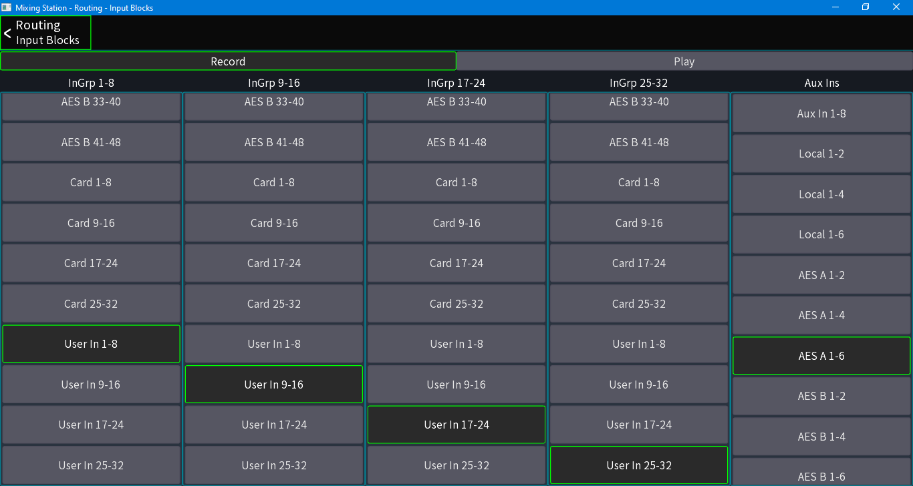
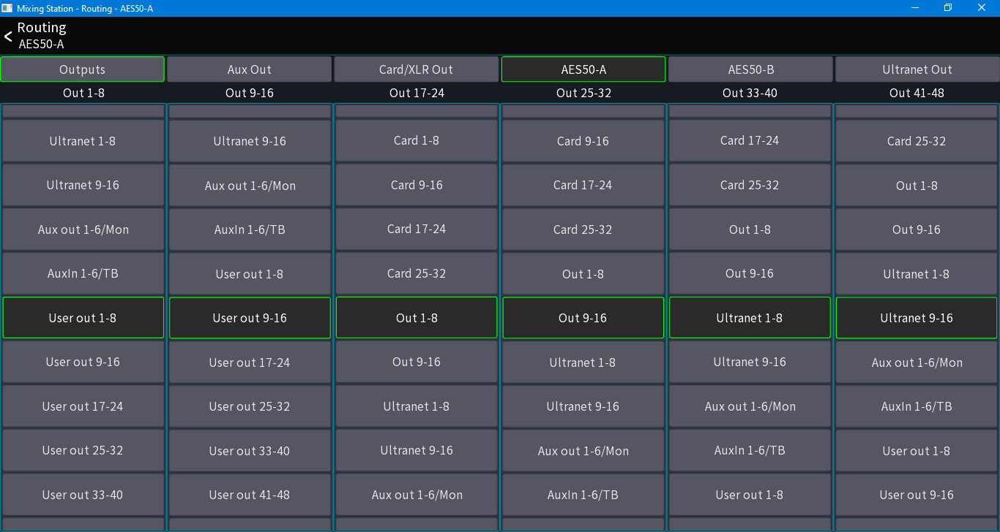
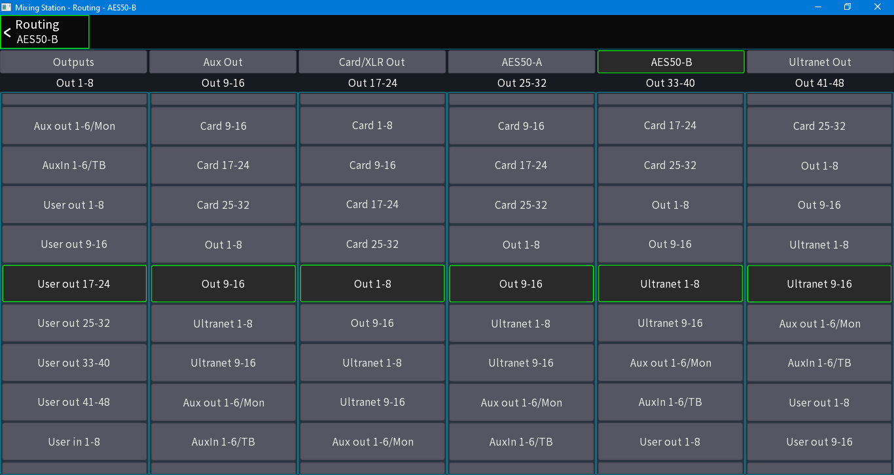
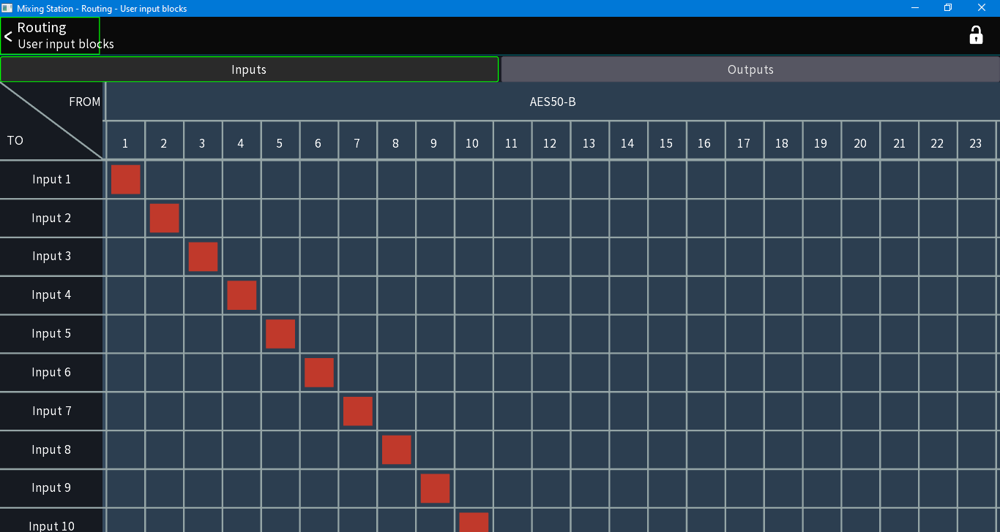
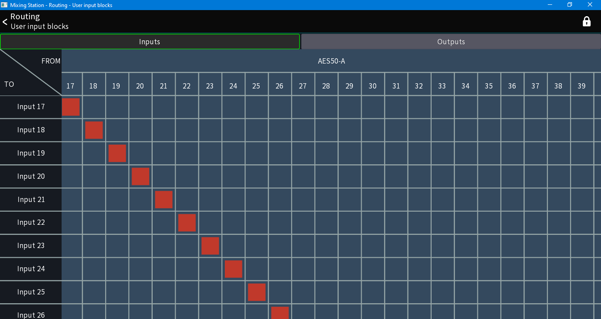
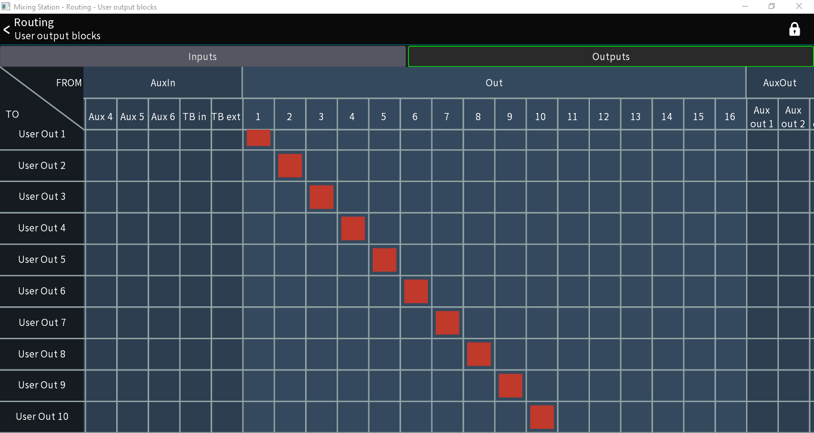
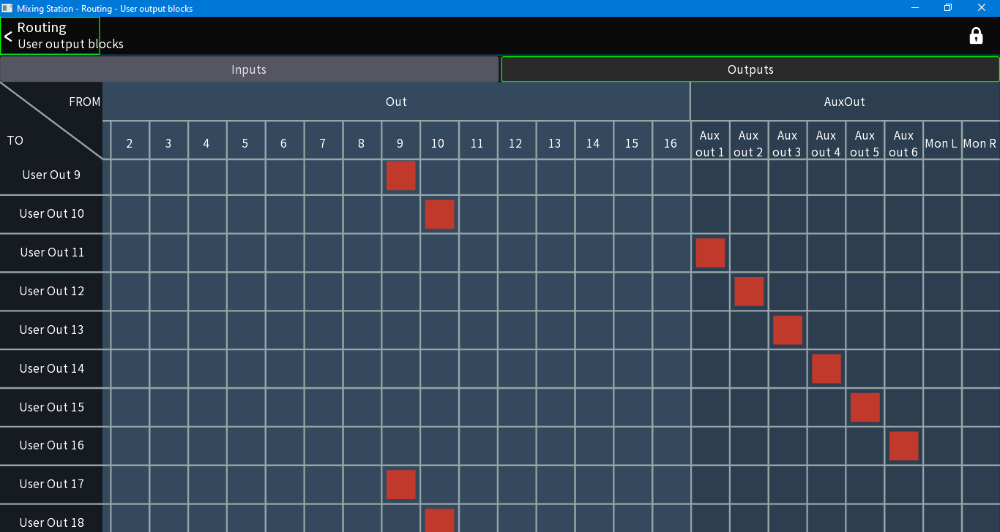
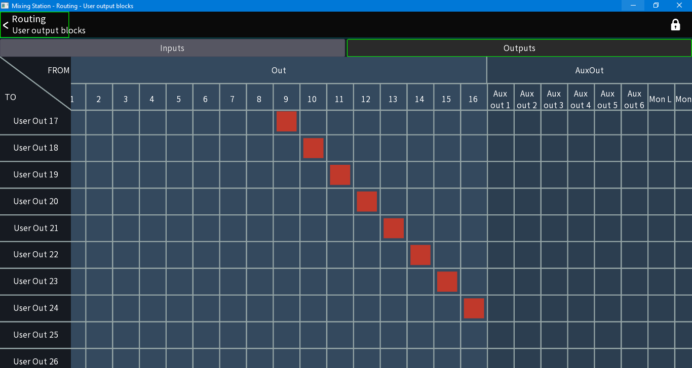
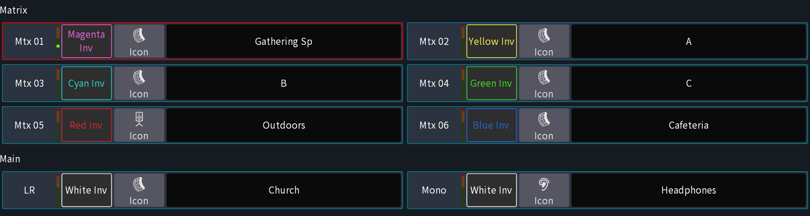

# Configuring the M32C

This document *every* step taken to configure the M32C for use in the Church.

# Routing

We are using two AES50 stage boxes to collect inputs from behind the sacristy as well as in the equipment room.

The final routing will give us

- DL16 (AES50B): Behind the Sacristy
    - Inputs 1-16 map to `User Input` 1-16
    - Ouputs 1-8 map to `User Output` 17-24
- DL32 (AES50A): In the Equipment Room
    - Inputs 1-6 map to `Aux Input` 1-6
    - Inputs 17-32 map to `User Input` 17-32
    - Outputs 1-16 map to `User Output` 1-16

## Input Blocks

- Under `Routing->Input Blocks` map all `InGrp` to the appropriate `User In` block.
- Under `Routing->Input Blocks` map `Aux Ins` to  `AES50A 1-6`.

This will allow us to have channel-by-channel control under the User Routing section rather than only being able to assign channels in 8 channel blocks.

**The *Play* section should look the same as the *Record* section**

## Output Blocks

The following assigns `User Out 1-25` to the appropriate outputs on our Stage Boxes

- Under `Routing->Output Routing` Map:
    - `AES50A`- `Out 1-8` to `User Out 1-8`
    - `AES50A`- `Out 9-16` to `User Out 9-16`
    - `AES50B`- `Out 1-8` to `User Out 17-25`

### AES50A Output Blocks

### AES50B Output Blocks

## User Routing

The previous two sections result in mapping the channel inputs to use the `User Inputs` and the AES50 snakes being fed by the `User Outputs`. 
Now, in the user routing, we control exactly which channels are mapped to each `User Input` and `User Output`

### User Input Routing

Make the appropriate mapping of AES50 connections to the user ins.

- `AES50B 1-16` to `In 1-16`
- `AES50A 17-32` to `In 17-32`

These mappings route the AES signals to the User inputs. This allows us to quickly do alternative routings for special events. (Individual channel mappings)

#### AES50B Inputs

#### AES50A Inputs

### User Output Routing

We are using this area to patch the console "outputs" to the physical outputs.
For the time being, I have the following setup:

- `User Output 1-10` from `Out 1-10`
- `User Output 11-16` from `Aux 1-6`
- `User Output 17-24` from `Out 9-16`

This may need to change as we want to send different outputs to different stage boxes.

# Channel Utilization

- Channels 1-16 are fed from behind the Scristy.
- Channels 17-24 and aux 1-16 are fed from the equipment room.

There are 7 Zones that we need separate mixes for.

| Zone | Location | Output Source |
| ---: | -------: | ------------: |
| Z1 | Worship Space | Main LR |
| Z2 | Gathering Space | Mtx 1 |
| Z3 | Meeting Room A | Mtx 2 |
| Z4 | Meeting Room B | Mtx 3 |
| Z5 | Meeting Room C | Mtx 4 |
| Z6 | Outside | Mtx 5 |
| Z7 | Lunchroom | Mtx 6 |

We also need a feed for the wireless broadcast for the hard-of-hearing. We will use **MONO** for this.

# Internal Routing

Because we have 8 potentially independent mixes within this console, we have to be creative.

The signal flow chain goes as follows:

Zone inputs come in on independent channels. All channels that are inputs of a specific zone get sent to a subgroup/mixbus. That mixbus can then be directed to any of the matrices/mainlr/mono sends. This is how we will combine the rooms.

For example,

If channel 1 is the podium mic input, I will route it to the mix bus for zone 1.

If the meeting rooms are part of the worship space, then we will need to send zone1's inputs to the meeting rooms. This would mean sending the zone1 mixbus to the matrices of room A, room B, and room C.

## Internal Setup

- Disable all channels send to LR
- Setup each mix bus as a subgroup tap
- Select each channel as part of the subgroup

# Appendix

## Appendix A: Channel Assignment

| Channel | Name | Source | Color |
| ------: | ---: | -----: | ----: |
| CH01 | SR POD | DL16 - AES50B - 01 | White |
| CH02 | Chair | DL16 - AES50B - 02 | White |
| CH03 | Altar | DL16 - AES50B - 03 | White |
| CH04 | SL POD | DL16 - AES50B - 04 | White |
| CH05 || DL16 - AES50B - 05 | Yellow |
| CH06 || DL16 - AES50B - 06 | Yellow |
| CH07 || DL16 - AES50B - 07 | Yellow |
| CH08 || DL16 - AES50B - 08 | Yellow |
| CH09 || DL16 - AES50B - 09 | Yellow |
| CH10 || DL16 - AES50B - 10 | Yellow |
| CH11 || DL16 - AES50B - 11 | Yellow |
| CH12 || DL16 - AES50B - 12 | Yellow |
| CH13 || DL16 - AES50B - 13 | Yellow |
| CH14 || DL16 - AES50B - 14 | Yellow |
| CH15 | Choir L | DL16 - AES50B - 15 | White |
| CH16 | Choir R | DL16 - AES50B - 16 | White |
| CH17 || DL32 - AES50A - 17 | Yellow |
| CH18 || DL32 - AES50A - 18 | Yellow |
| CH19 || DL32 - AES50A - 19 | Yellow |
| CH20 || DL32 - AES50A - 20 | Yellow |
| CH21 || DL32 - AES50A - 21 | Yellow |
| CH22 || DL32 - AES50A - 22 | Yellow |
| CH23 || DL32 - AES50A - 23 | Yellow |
| CH24 || DL32 - AES50A - 24 | Yellow |
| CH25 || DL32 - AES50A - 25 | Yellow |
| CH26 || DL32 - AES50A - 26 | Yellow |
| CH27 || DL32 - AES50A - 27 | Yellow |
| CH28 || DL32 - AES50A - 28 | Yellow |
| CH29 || DL32 - AES50A - 29 | Yellow |
| CH30 || DL32 - AES50A - 30 | Yellow |
| CH31 || DL32 - AES50A - 31 | Yellow |
| CH32 || DL32 - AES50A - 32 | Yellow |
| Aux1 || DL32 - AES50A - 1 | Green |
| Aux2 || DL32 - AES50A - 2 | Green |
| Aux3 || DL32 - AES50A - 3 | Green |
| Aux4 || DL32 - AES50A - 4 | Green |
| Aux5 || DL32 - AES50A - 5 | Green |
| Aux6 || DL32 - AES50A - 6 | Green |
| Aux7 || USB L | Yellow |
| Aux8 || USB R | Yellow |
| FX1L | FX | FX Return 1L | Magenta |
| FX1R | FX | FX Return 1R | Magenta |
| FX2L | FX | FX Return 2L | Magenta |
| FX2R | FX | FX Return 2R | Magenta |
| FX3L | FX | FX Return 3L | Magenta |
| FX3R | FX | FX Return 3R | Magenta |
| FX4L | FX | FX Return 4L | Magenta |
| FX4R | FX | FX Return 4R | Magenta |

| Channel | Name | Source | Color |
| ------: | ---: | -----: | ----: |
| Bus01 | Choir L || White |
| Bus02 | Choir R || White |
| Bus03 | Church Mics || White |
| Bus04 | MixBus 4 || Black |
| Bus05 | MixBus 5 || Black |
| Bus06 | MixBus 6 || Black |
| Bus07 | Gathering Sp || Magenta |
| Bus08 | MR A || Yellow |
| Bus09 | MR B || Cyan |
| Bus10 | MR C || Green |
| Bus11 | Outdoors || Red |
| Bus12 | Cafeteria || Blue |
| Bus13 | FX 1 || Magenta |
| Bus14 | FX 2 || Magenta |
| Bus15 | FX 3 || Magenta |
| Bus16 | FX 4 || Magenta |

| Channel | Name | Destination | Color |
| ------: | ---: | ----------: | ----: |
| LR | Church out || White Inv |
| Mono | Headphones || White Inv |
| Mtx1 | Gathering Space Out || Magenta Inv |
| Mtx2 | MR A Out || Yellow Inv |
| Mtx3 | MR B Out || Cyan Inv |
| Mtx4 | MR C Out || Green Inv |
| Mtx5 | Outside Out || Red Inv |
| Mtx6 | Cafeteria Out || Blue Inv |

| Channel | Name | Source | Color |
| ------: | ---: | -----: | ----: |
| DCA1 | DCA 1 || White |
| DCA2 | DCA 2 || White |
| DCA3 | DCA 3 || White |
| DCA4 | DCA 4 || White |
| DCA5 | DCA 5 || White |
| DCA6 | DCA 6 || White |
| DCA7 | DCA 7 || White |
| DCA8 | DCA 8 || White |

| User Output | Source | Tap |
| ----------: | -----: | --: |
| 1 | Mtx 1 | Post Fadar |
| 2 | Mtx 2 | Post Fadar |
| 3 | Mtx 3 | Post Fadar |
| 4 | Mtx 4 | Post Fadar |
| 5 | Mtx 5 | Post Fadar |
| 6 | Mtx 6 | Post Fadar |
| 7 | Main L | Post Fadar |
| 8 | Main R | Post Fadar |
| 9 | Main M/C | Post Fadar |
| 10 |||
| 11 |||
| 12 |||
| 13 |||
| 14 |||
| 15 |||
| 16 |||
