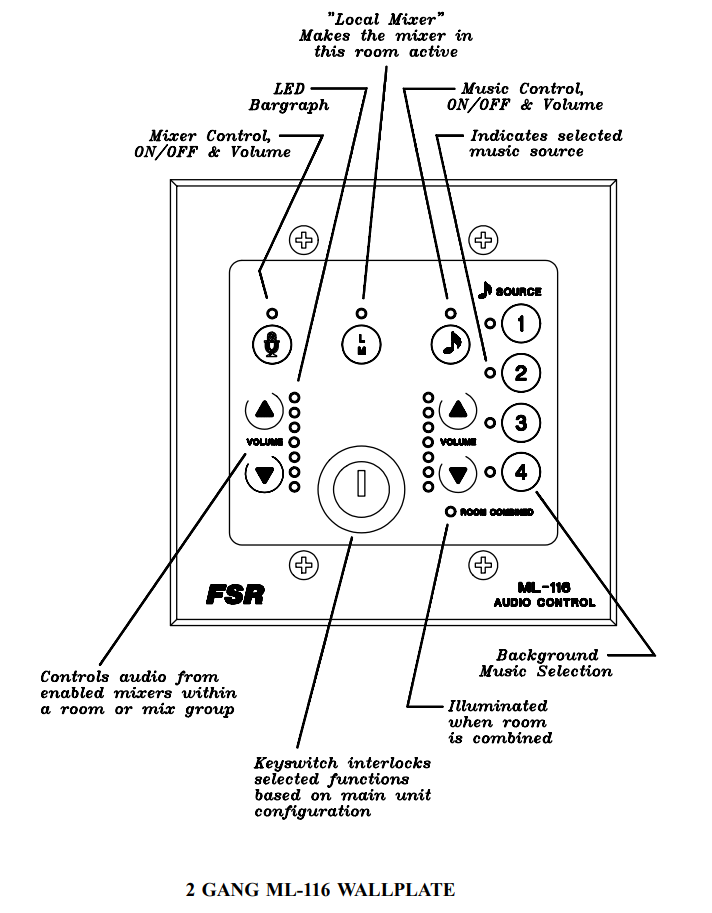
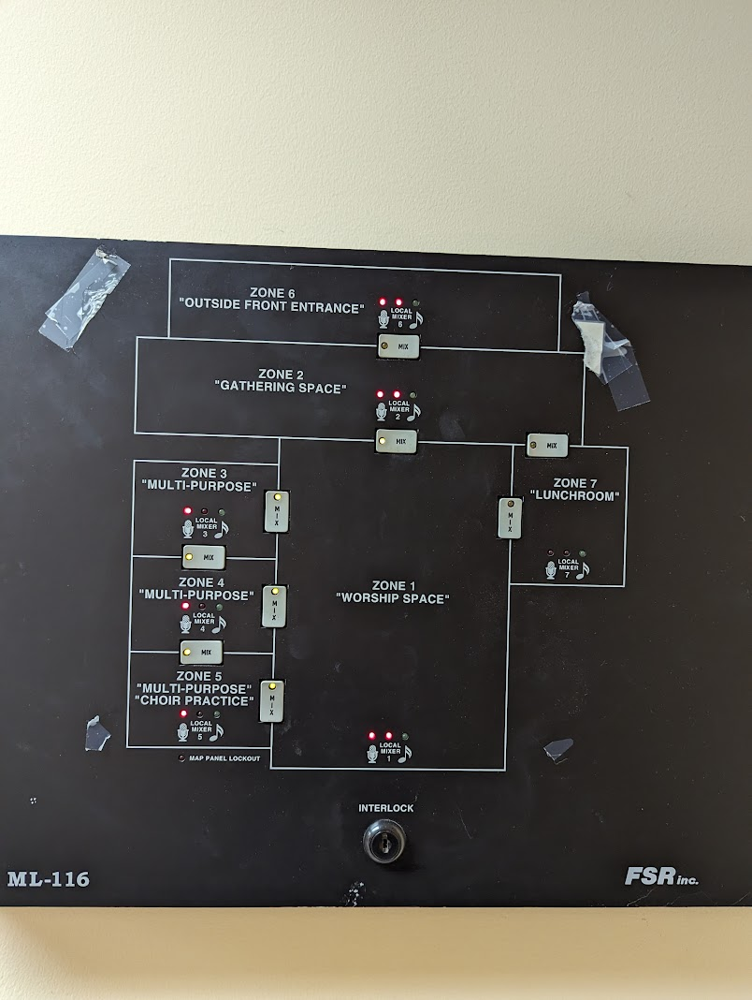
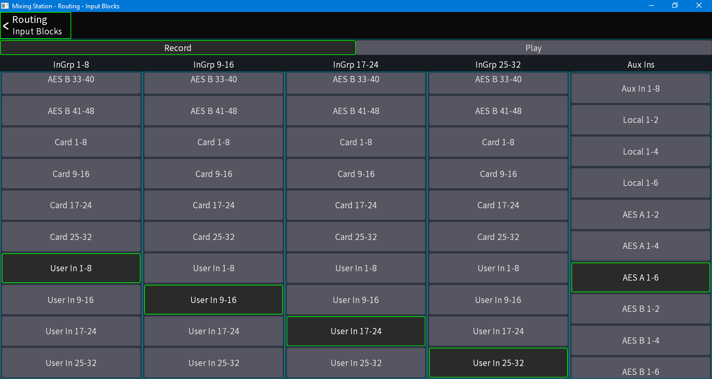
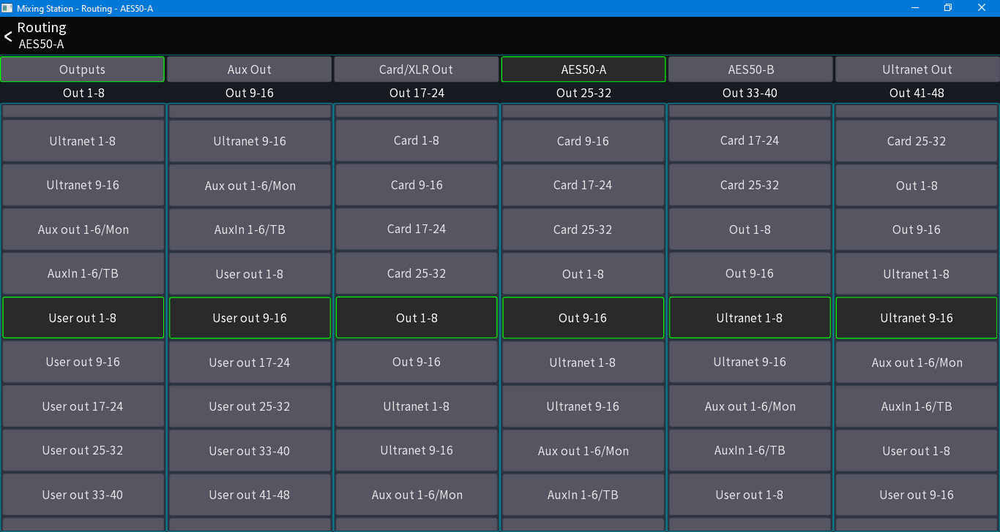
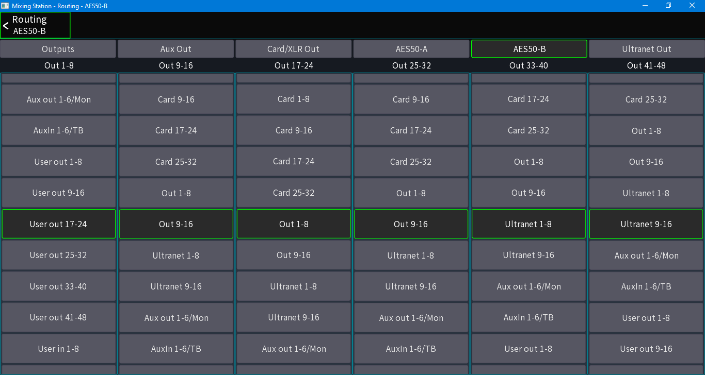

# Configuring the M32C

This document outlines *every* step taken to configure the M32C for use in the Church.

**Note on Current vs. Future System State:**
We are currently in a transitional phase. The console is internally programmed to handle discrete stereo and matrix zone outputs for a future Midas DL32 stagebox installation. However, currently, the physical room combining and amplification is handled by an FSR ML-800 in the mechanical room, which receives a single Mono feed from the Sacristy DL16. 

# EMERGENCY START-UP: Power Outage Recovery

When the building loses power, the FSR audio distribution system defaults to an "Off" and "Uncombined" state. Even if the M32 mixer is working perfectly, **no sound will reach the speakers until you manually reset the FSR panels.**

If there is no sound in the church after a power outage, follow these three steps:

## Step 1: Reactivate the Local Mixer (Choir/Piano Area)

Go to the FSR wallplate located near the choir/piano.

1. Press the **Mixer Control ON** button (the button with the microphone icon). Ensure the LED indicator lights up.
2. Press the **LOCAL MIXER ON/OFF** button. This tells the system to accept the audio feed from the microphones.

## Step 2: Recombine the Audio Zones (Sacristy)

After a power cycle, the overflow rooms and hall will be isolated from the main church audio. Go to the Sacristy to link them back together.

1. Locate the custom wall panel labeled **CHURCH & HALL ROOM COMBINER**.
2. Press the necessary **Mix** buttons on the right side of the panel (e.g., **Mix 1-2**, **Mix 2-3**, **Mix 3-4**, etc.) to link the audio zones back together. 
3. The LEDs next to the buttons will illuminate to confirm the rooms are actively sharing audio.

## Step 3: Verify the Network & Mixer Core (Sacristy)

If steps 1 and 2 are complete and there is still no sound, verify the digital mixer core is communicating:

1. **Check the DL16 Stagebox:** Ensure it is powered on and the AES50 status light on the front is **GREEN**. If it is red or flashing, it has lost sync with the M32C.
2. **Check the Network:** Ensure the UniFi mini switch in the rack is powered on and showing activity lights. The Mixing Station app on the iPad relies entirely on this switch to communicate with the M32C mixer.

# System Adjustments & Overrides (Mixing Station Guide)

The audio system is designed to be **"set and forget."** Under normal circumstances, the AutoMixer and FSR room combiner handle everything automatically, and you should not need to touch the digital console. 

Opening the Mixing Station app on the iPad is only necessary if something has gone wrong, an unusual adjustment is needed for a specific speaker, or the system needs to be reset for a special event.

## 1. Connecting to the Audio Network
To control the console, your device must be on the correct network.
* **Wireless (iPad/Tablet):** The device must be connected to the **IoT VLAN**. Contact the facilities manager for the current Wi-Fi password and access provisioning.
* **Wired (Laptop/Mac):** Alternatively, you can plug a computer directly into the UniFi mini switch located in the Sacristy equipment rack using a standard Ethernet cable.

## 2. Launching Mixing Station
Once connected to the correct network:
1. Open the **Mixing Station** app.
2. Select the **X32/M32** console family.
3. Tap **Connect**.
4. If the console is not automatically discovered, enter the hostname: `m32-1.annunlord.com`.

## 3. Restoring the Baseline System State
If the audio routing has been altered for a special event or accidentally changed, you can restore the system to its normal state using one of two methods:

### Method A: Via Mixing Station (Preferred)
1. Tap the **Folder/Menu** icon in the top right corner of the app.
2. Navigate to **Scenes**.
3. Locate and select the baseline scene (e.g., `Annunlord2026-03-15`).
4. Tap **Load** and confirm.

### Method B: Via USB (Hardware Fallback)
If the iPad is completely dead or the network is down, you can restore the entire console configuration directly from the M32C front panel.
1. Download the latest `console.bak` file from the repository.
2. Save it to the root directory of a FAT32-formatted USB flash drive.
3. Plug the USB drive into the front port of the M32C in the Sacristy.
4. Using the front panel knobs, navigate to **Setup -> Global**.
5. Select **Import** and choose the `console.bak` file from the USB drive.

## 4. Making Manual Adjustments
Currently, we do not use custom UI layouts. The standard app interface provides everything needed to adjust the mix.

* **The Main Fader Bank:** Swipe to the main fader bank layer in Mixing Station. This is your primary control surface.
* **Individual Mics:** Use channels 1-6 to unmute or adjust the individual Podiums, Chair, Altar, and Lavaliers if a specific speaker is unusually quiet or loud.
* **Church Mics (Bus 03):** This is your master subgroup for all spoken word. If the priest and readers are all universally too loud or too quiet, adjust this single fader rather than chasing individual microphone channels.
* **Main LR:** This is the master volume for the entire worship space. Ensure it is unmuted and set near unity (0 dB).

# Routing Topology

We use AES50 stage boxes to collect inputs and distribute outputs. 

- **Phase 1 (Current) - DL16 (AES50B):** Located in the Sacristy.
  - Handles all current wireless and physical inputs (Ch 1-16).
  - Output 5 provides the Mono/Center master mix to the FSR ML-800 via a single XLR run to the mechanical room. 
- **Phase 2 (Future) - DL32 (AES50A):** To be installed in the Mechanical Room.
  - Inputs 1-6 map to `Aux Input` 1-6.
  - Inputs 17-32 map to `User Input` 17-32.
  - Outputs 1-16 map to `User Output` 1-16 to provide true discrete stereo and zone matrix feeds to the Crown CDi1000 amps and QSC K12.2 choir speakers.

## Input Blocks

- Under `Routing->Input Blocks` map all `InGrp` to the appropriate `User In` block.
- Under `Routing->Input Blocks` map `Aux Ins` to `AES50A 1-6`.

This allows us to have channel-by-channel control under the User Routing section rather than only being able to assign channels in strict 8-channel blocks.

**The *Play* section should look the same as the *Record* section**

## Output Blocks

The following assigns `User Out 1-24` to the appropriate outputs on our Stage Boxes.

- Under `Routing->Output Routing` Map:
    - `AES50A`- `Out 1-8` to `User Out 1-8`
    - `AES50A`- `Out 9-16` to `User Out 9-16`
    - `AES50B`- `Out 1-8` to `User Out 17-24`

### AES50A Output Blocks (Future DL32)

### AES50B Output Blocks (Current DL16)

## User Routing

### User Input Routing

Make the appropriate mapping of AES50 connections to the user ins.
- `AES50B 1-16` to `In 1-16` (Sacristy DL16)
- `AES50A 17-32` to `In 17-32` (Mechanical Room DL32)

These mappings route the AES signals to the User inputs, allowing us to quickly do alternative routings for special events without changing the physical patch.

### User Output Routing

We use this area to patch the console "outputs" to the physical outputs on the stage boxes. 

*Currently programmed routing based on M32 Output block 1-16:*
- `User Output 1` from `Mtx 5` (Outdoors)
- `User Output 2` from `Mtx 6` (Cafeteria)
- `User Output 3-4` from `Main L/R`
- `User Output 5` from `Mono/Center` **(Current feed to FSR ML-800)**
- `User Output 7` from `Bus 2` (Choir R)
- `User Output 8 & 16` from `Bus 3` (Church Mics)
- `User Output 9 & 15` from `Bus 4` (Church Mains)
- `User Output 10-13` from `Bus 1` (Choir L)
- `User Output 14` from `Bus 8` (Meeting Room A)

# Channel Utilization

- Channels 1-16 are fed from the Sacristy (DL16).
- Channels 17-32 and Aux 1-6 are reserved for the Mechanical Room (DL32).

There are 7 Zones configured in the console logic:

| Zone | Location | Output Source |
| ---: | -------: | ------------: |
| Z1 | Worship Space | Main LR |
| Z2 | Gathering Space | Mtx 1 |
| Z3 | Meeting Room A | Mtx 2 |
| Z4 | Meeting Room B | Mtx 3 |
| Z5 | Meeting Room C | Mtx 4 |
| Z6 | Outside | Mtx 5 |
| Z7 | Lunchroom | Mtx 6 |

We also need a feed for the wireless broadcast for the hard-of-hearing. We will use **MONO** for this.

# Internal Routing & AutoMixing

Because we have multiple microphones and zones, signal flow is managed via Subgroups and the AutoMixer.

- **Spoken Word (AutoMixer):** Ch 1-6 (Pods, Altar, Lavs) are assigned to the AutoMixer (Group X) to manage gain-before-feedback. They are routed to **Bus 03 (Church Mics)**, which then feeds the Main LR and Mono.
- **Choir (Stereo):** Ch 15 & 16 are routed to **Bus 01 & 02**, hard-panned left and right, completely bypassing the spoken-word AutoMixer. 
- **Zone Feeds:** The Main LR feeds the Matrixes. When the DL32 is installed, this will allow independent EQ and delay for the overflow zones. 

# Signal Processing & Feedback Management

To ensure maximum speech intelligibility and gain-before-feedback, the system relies on a specific sequence of channel parametric EQs (PEQ), dynamic limiters, the AutoMixer, and master insert Graphic EQs (GEQ).

## 1. Channel Processing (Input Stage)
Before any audio reaches a mix bus, it undergoes heavy shaping at the channel level.

* **Low-Frequency Roll-off (HPF):** All spoken word channels (Pods, Altar, Lavs) and Choir mics have a High-Pass Filter engaged at roughly **124 Hz**. This removes HVAC rumble, handling noise, and proximity boominess.
* **Feedback & Resonance Cuts (PEQ):** The individual channel EQs are aggressively notched to remove room resonance. For example, the Altar mic (Ch 3) has deep cuts of **-12.2 dB at 306 Hz** and **-12.2 dB at 990 Hz**.
* **Brickwall Peak Limiting:** All spoken-word and choir channels have their compressor set as a hard peak limiter (**100:1 ratio**). This prevents sudden loud transients (like someone tapping the mic or shouting) from clipping the system.

## 2. The AutoMixer (Gain Sharing)
* **Group X:** Channels 1 through 6 (Pods, Altar, and Lavs) are assigned to the AutoMixer (Group X). 
* **Function:** The AutoMixer automatically turns down inactive microphones while keeping the active speaker present. This prevents the combined background noise and phase-cancellation of 6 open microphones from causing a feedback loop.
* **Choir Isolation:** The Choir microphones (Ch 15 & 16) bypass the AutoMixer entirely so continuous singing does not artificially mute the spoken-word microphones.

## 3. Master Inserts & Final Output Processing
Once the audio leaves the mix buses and hits the master outputs, it runs through dedicated hardware-emulated Graphic EQs and Master Compressors.

* **Main L/R (Church Mix) Feedback Rejection:** * The Main L/R bus uses **FX8 (Dual GEQ)** as a **POST-Fader Insert**. 
    * This GEQ has massive cuts dialed in (up to **-15 dB**) specifically targeting low/low-mid room build-up. This acts as the final line of defense against room feedback for the worship space.
* **Matrix Zones (Meeting Rooms):**
    * Matrixes 1 through 4 (Gathering Space, MR A, B, and C) use **FX6 and FX7 (Dual GEQs)** as **PRE-Fader Inserts**. This allows independent ringing-out of the overflow rooms.
* **Mono/Center (FSR feed & Hard-of-Hearing):**
    * Instead of an EQ insert, the Mono bus uses extremely heavy **RMS Compression** (Ratio 100:1, Threshold -35.0 dB). This heavily squashes the dynamic range so that whispers and loud speaking are output at the exact same volume to the FSR ML-800 and hearing assist systems.

---

### Signal Processing Flowchart

*(To view this diagram, paste the code block below into a Mermaid viewer like Mermaid Live Editor or a compatible Markdown previewer).*

```mermaid
graph LR
    %% Styling
    classDef input fill:#2c3e50,stroke:#ecf0f1,stroke-width:2px,color:#ecf0f1;
    classDef proc fill:#d35400,stroke:#ecf0f1,stroke-width:2px,color:#ecf0f1;
    classDef mix fill:#27ae60,stroke:#ecf0f1,stroke-width:2px,color:#ecf0f1;
    classDef insert fill:#8e44ad,stroke:#ecf0f1,stroke-width:2px,color:#ecf0f1;
    classDef out fill:#c0392b,stroke:#ecf0f1,stroke-width:2px,color:#ecf0f1;

    %% -------------------
    %% Input Stage
    %% -------------------
    subgraph Input Stage
        Mics["Spoken Word Mics\n(Ch 1-6)"]:::input
        Choir["Choir Mics\n(Ch 15-16)"]:::input
    end

    %% -------------------
    %% Channel Processing
    %% -------------------
    subgraph Channel Processing
        MicEQ["Channel PEQ\n(HPF 124Hz + Feedback Notches)"]:::proc
        MicComp["Dynamics\n(100:1 Peak Limiter)"]:::proc
        ChoirEQ["Channel PEQ\n(HPF 124Hz)"]:::proc
        ChoirComp["Dynamics\n(100:1 Peak Limiter)"]:::proc
    end

    Mics --> MicEQ --> MicComp
    Choir --> ChoirEQ --> ChoirComp

    %% -------------------
    %% AutoMix & Busing
    %% -------------------
    subgraph AutoMix & Subgroups
        AMix{"AutoMixer\n(Group X)"}:::proc
        Bus3["Bus 03:\nChurch Mics"]:::mix
        Bus1_2["Bus 01/02:\nChoir L/R"]:::mix
    end

    MicComp --> AMix --> Bus3
    ChoirComp --> Bus1_2

    %% -------------------
    %% Master Buses
    %% -------------------
    subgraph Masters & Matrixes
        MainLR["Main L/R Mix"]:::mix
        MainMono["Mono/Center Mix"]:::mix
        MtxZones["Matrix Zones 1-4\n(Gathering/Meeting)"]:::mix
    end

    Bus3 --> MainLR & MainMono
    Bus1_2 --> MainLR
    MainLR -. "Sends" .-> MtxZones

    %% -------------------
    %% Master Inserts & Dynamics
    %% -------------------
    subgraph Final Processing
        MainGEQ["Main LR Insert\nFX8 GEQ (Post-Fader)\n*Heavy Feedback Cuts*"]:::insert
        MonoDyn["Mono Dynamics\n*Heavy RMS Comp (100:1)*"]:::proc
        MtxGEQ["Matrix Inserts\nFX6/FX7 GEQs (Pre-Fader)"]:::insert
    end

    MainLR --> MainGEQ
    MainMono --> MonoDyn
    MtxZones --> MtxGEQ

    %% -------------------
    %% Physical Output
    %% -------------------
    subgraph Physical Outputs
        OutFSR["DL16 Out 5 -> FSR ML-800\n(Current State)"]:::out
        OutQSC["DL32 Out 3/4 -> QSC Mains\n(Future)"]:::out
        OutZones["DL32 Outs -> FSR/Amps\n(Future)"]:::out
    end

    MonoDyn --> OutFSR
    MainGEQ -.-> OutQSC
    MtxGEQ -.-> OutZones
```
# Appendix

## Appendix A: Channel Assignment

| Channel | Name | Source | Color |
| ------: | ---: | -----: | ----: |
| CH01 | SR POD | DL16 - AES50B - 01 | White |
| CH02 | Chair | DL16 - AES50B - 02 | White |
| CH03 | Altar | DL16 - AES50B - 03 | White |
| CH04 | SL POD | DL16 - AES50B - 04 | White |
| CH05 | LAV1 | DL16 - AES50B - 05 | Yellow |
| CH06 | LAV2 | DL16 - AES50B - 06 | Yellow |
| CH07 || DL16 - AES50B - 07 | Yellow |
| CH08 || DL16 - AES50B - 08 | Yellow |
| CH09 || DL16 - AES50B - 09 | Yellow |
| CH10 || DL16 - AES50B - 10 | Yellow |
| CH11 || DL16 - AES50B - 11 | Yellow |
| CH12 || DL16 - AES50B - 12 | Yellow |
| CH13 || DL16 - AES50B - 13 | Yellow |
| CH14 || DL16 - AES50B - 14 | Yellow |
| CH15 | Choir L | DL16 - AES50B - 15 | White |
| CH16 | Choir R | DL16 - AES50B - 16 | White |
| CH17-32 | (Future Use) | DL32 - AES50A - 17-32 | Yellow |
| Aux1-6 | (Future Use) | DL32 - AES50A - 1-6 | Green |
| Aux7 | USB L | USB Return L | Yellow |
| Aux8 | USB R | USB Return R | Yellow |
| FX1 L/R | Vintage Room | FX Return 1 | Magenta |
| FX2 L/R | Hall Reverb | FX Return 2 | Magenta |
| FX3 L/R | Stereo Delay | FX Return 3 | Magenta |
| FX4 L/R | Stereo Chorus | FX Return 4 | Magenta |

## Appendix B: Bus & Matrix Assignments

| Channel | Name | Destination / Function | Color |
| ------: | ---: | ----------: | ----: |
| Bus01 | Choir L | Main L | White |
| Bus02 | Choir R | Main R | White |
| Bus03 | Church Mics | Main LR + Mono | White |
| Bus04 | Church Mains | Main LR | Black |
| Bus08 | MR A | Matrix 2 Feed | Yellow |
| Bus11 | Outdoors | Matrix 5 Feed | Red |
| Bus12 | Cafeteria | Matrix 6 Feed | Blue |
| Bus13 | FX 1 Send | Vintage Room | Magenta |
| Bus14 | FX 2 Send | Hall Reverb | Magenta |
| Bus15 | FX 3 Send | Stereo Delay | Magenta |
| Bus16 | FX 4 Send | Stereo Chorus | Magenta |

| Channel | Name | Destination | Color |
| ------: | ---: | ----------: | ----: |
| LR | Main Church | Phase 2 DL32 Out 3/4 | White Inv |
| Mono | FSR ML-800 / HOH | Phase 1 DL16 Out 5 | White Inv |
| Mtx1 | Gathering Space | - | Magenta Inv |
| Mtx2 | MR A | - | Yellow Inv |
| Mtx3 | MR B | - | Cyan Inv |
| Mtx4 | MR C | - | Green Inv |
| Mtx5 | Outside Out | Phase 2 DL32 Out 1 | Red Inv |
| Mtx6 | Cafeteria Out | Phase 2 DL32 Out 2 | Blue Inv |

## Appendix C: Output Patching (User Outs 1-16)

| User Output | Console Source | Physical Destination |
| ----------: | -----: | :-- |
| 1 | Mtx 5 | Outdoors (Future DL32) |
| 2 | Mtx 6 | Cafeteria (Future DL32) |
| 3 | Main L | Church Mains L |
| 4 | Main R | Church Mains R |
| 5 | Mono/Center | **FSR ML-800 Room Combiner Input** |
| 6 | - | - |
| 7 | Bus 2 | Choir R Direct |
| 8 | Bus 3 | Church Mics Direct |
| 9 | Bus 4 | Church Mains Direct |
| 10 | Bus 1 | Choir L Direct |
| 11 | Bus 1 | Choir L Direct |
| 12 | Bus 1 | Choir L Direct |
| 13 | Bus 1 | Choir L Direct |
| 14 | Bus 8 | Meeting Room A Direct |
| 15 | Bus 4 | Church Mains Direct |
| 16 | Bus 3 | Church Mics Direct |
